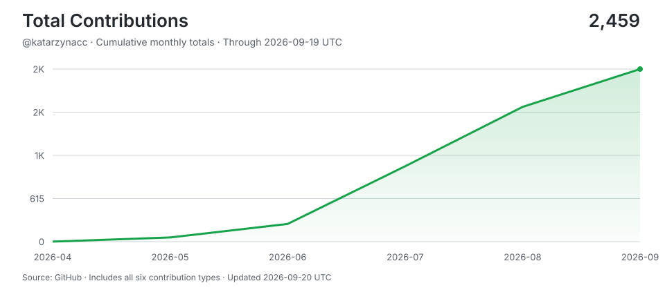

# Kasia CC

> Shipping with AI agents around the clock -- human hours for thinking, machine hours for doing.
>
> Stats auto-updated by [aidevops](https://aidevops.sh).

<!-- STATS-START -->
## Work with AI

| Metric | Yesterday | Prior 7 Days | Prior 28 Days | Prior 365 Days |
| --- | ---: | ---: | ---: | ---: |
| Screen time (Linux) | 24h | 167.9h | 541.6h | ~7405h* |
| Interactive human attention | 0.6h | 9.2h | 47.7h | 101.9h |
| Interactive AI generation | 1.0h | 20.3h | 124.0h | 260.6h |
| Worker-classified human attention | 0.9h | 3.7h | 29.2h | 35.0h |
| Worker/headless AI generation | 10.9h | 87.5h | 308.4h | 1217.7h |
| Additive observed work | 13.2h | 120.2h | 507.4h | 1,612.5h |
| Interactive sessions | 1 | 4 | 48 | 116 |
| Worker sessions | 198 | 1,154 | 5,211 | 12,945 |

_Screen time from screen-time-history:daily-observations; collection status: ok. *365-day estimate uses observed calendar coverage._

_Periods are completed local calendar days ending at midnight; today is excluded._

_Human attention is unioned wall-clock time, so overlapping sessions are not double-counted. AI generation is additive machine work across sessions; it is not wall-clock concurrency._

_AI session 365-day totals cover 72 days of local assistant session history (not extrapolated)._

## AI Model Usage (last 30 days)

| Model | Requests | Input | Output | Cache read | Cache Hit-Rate % | Session Count | Session Hours |
| --- | ---: | ---: | ---: | ---: | ---: | ---: | ---: |
| claude-sonnet-4-6 | 63,905 | 68K | 21.8M | 7,837.0M | 100.0% | 1,673 | 359.5h |
| claude-opus-4-6 | 3,783 | 4K | 1.2M | 442.1M | 100.0% | 187 | 22.6h |
| gpt-5.6-luna | 3,460 | 33.2M | 167K | 27.6M | 45.4% | 3,267 | 14.1h |
| gpt-5.6-terra | 2,909 | 23.4M | 690K | 201.9M | 89.6% | 278 | 20.8h |
| gpt-5.6-sol-fast | 1,386 | 8.9M | 319K | 153.8M | 94.5% | 6 | 18.4h |
| x-preview-f-free | 1,238 | 5.5M | 296K | 172.5M | 96.9% | 7 | 12.3h |
| gpt-5.6-sol | 992 | 5.0M | 231K | 111.6M | 95.7% | 29 | 8.8h |
| claude-haiku-4-5 | 756 | 4K | 159K | 45.6M | 100.0% | 22 | 3.4h |
| gpt-5.5-fast | 366 | 1.7M | 88K | 39.5M | 95.9% | 2 | 3.1h |
| claude-opus-4-8 | 357 | 708 | 367K | 69.8M | 100.0% | 1 | 3.6h |
| nemotron-3-ultra-free | 198 | 4.6M | 13K | 25.0M | 84.3% | 1 | 1.2h |
| pool-account-management | 1 | 0 | 0 | 0 | 0.0% | 1 | 0.0h |
| **Total** | **79,351** | **82.6M** | **25.4M** | **9,126.9M** | **99.1%** | **5,457** | **467.9h** |

_9,480.8M total tokens processed. 99.1% cache hit rate._

## AI Model Usage (all time)

| Model | Requests | Input | Output | Cache read | Cache Hit-Rate % | Session Count | Session Hours |
| --- | ---: | ---: | ---: | ---: | ---: | ---: | ---: |
| claude-sonnet-4-6 | 180,658 | 194K | 64.1M | 17,080.5M | 100.0% | 4,457 | 1,002.7h |
| deepseek-v4-flash-free | 15,088 | 36.8M | 3.1M | 1,278.4M | 97.2% | 199 | 47.7h |
| gpt-5.6-sol | 13,561 | 65.2M | 2.9M | 1,108.1M | 94.4% | 691 | 97.3h |
| claude-opus-4-6 | 13,168 | 14K | 4.4M | 1,258.8M | 100.0% | 555 | 74.0h |
| claude-sonnet-4-5 | 8,013 | 20K | 1.9M | 318.8M | 100.0% | 300 | 21.9h |
| gpt-5.6-terra | 6,069 | 37.9M | 1.3M | 358.2M | 90.4% | 1,191 | 40.7h |
| claude-haiku-4-5 | 4,892 | 20K | 960K | 275.1M | 100.0% | 137 | 18.7h |
| gpt-5.6-luna | 4,773 | 44.4M | 290K | 57.4M | 56.4% | 4,175 | 19.6h |
| gpt-5.5 | 4,642 | 13.3M | 741K | 190.8M | 93.5% | 275 | 52.1h |
| gpt-5.4 | 4,186 | 15.8M | 1.0M | 239.4M | 93.8% | 201 | 31.3h |
| claude-sonnet-4-5 | 2,567 | 31K | 969K | 180.5M | 100.0% | 39 | 14.0h |
| gpt-5.6-sol-fast | 1,386 | 8.9M | 319K | 153.8M | 94.5% | 6 | 18.4h |
| x-preview-f-free | 1,238 | 5.5M | 296K | 172.5M | 96.9% | 7 | 12.3h |
| gpt-5.4-mini | 746 | 1.8M | 108K | 37.2M | 95.2% | 27 | 3.9h |
| gpt-5.5-fast | 366 | 1.7M | 88K | 39.5M | 95.9% | 2 | 3.1h |
| claude-opus-4-8 | 357 | 708 | 367K | 69.8M | 100.0% | 1 | 3.6h |
| nemotron-3-ultra-free | 198 | 4.6M | 13K | 25.0M | 84.3% | 1 | 1.2h |
| north-mini-code-free | 28 | 915K | 284 | 0 | 0.0% | 2 | 0.0h |
| claude-sonnet-4 | 1 | 0 | 0 | 0 | 0.0% | 1 | 0.0h |
| pool-account-management | 1 | 0 | 0 | 0 | 0.0% | 1 | 0.0h |
| **Total** | **261,938** | **237.6M** | **83.2M** | **22,844.6M** | **99%** | **12,214** | **1,462.7h** |

_23,772.0M total tokens processed. 99% cache hit rate._
<!-- STATS-END -->

<!-- CONTRIBUTIONS-START -->
## Contributions

- **[aidevops](https://github.com/marcusquinn/aidevops)** -- Vibe-Coding is easy. DevOps is hard. OpenCode & Git token-efficient AI agent automation for your app, business, and personal development. Opinionated tools, services, CLI & API stack for speed, security, and 24/7 results. Open-source first. SOTA everything. Try on your repos for money-making magic.
<!-- CONTRIBUTIONS-END -->

## Connect

---

<!-- UPDATED-START -->
_Stats auto-updated 2026-09-12 02:01 UTC by [aidevops](https://aidevops.sh) pulse._
<!-- UPDATED-END -->

<!-- TOTAL-CONTRIBUTIONS-START -->

  <a href="https://commit-history.com/katarzynacc?metric=total" target="_blank" rel="noopener noreferrer">
    <picture>
      <source media="(prefers-color-scheme: dark)" srcset="assets/contributions/total-dark.svg" />
      
    </picture>
  </a>

[Verify on commit-history.com](https://commit-history.com/katarzynacc?metric=total) · [Chart data](assets/contributions/total.json)

Includes commits, issues, pull requests, reviews, repositories, and restricted contributions. Refreshed daily through the prior UTC day; commit-history.com may use a different refresh cutoff. GitHub controls link navigation—Ctrl/Cmd-click opens verification in a new tab.
<!-- TOTAL-CONTRIBUTIONS-END -->
