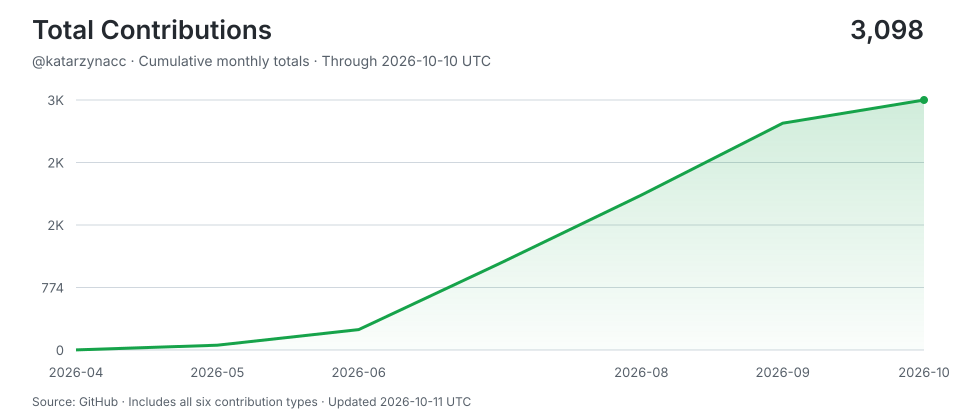

# Kasia CC

> Shipping with AI agents around the clock -- human hours for thinking, machine hours for doing.
>
> Stats auto-updated by [aidevops](https://aidevops.sh).

<!-- STATS-START -->
## Work with AI

| Metric | Yesterday | Prior 7 Days | Prior 28 Days | Prior 365 Days |
| --- | ---: | ---: | ---: | ---: |
| Screen time (Linux) | 0h | 27h | 452.4h | ~7548h* |
| Interactive human attention | 0.0h | 7.2h | 52.5h | 153.9h |
| Interactive AI generation | 0.0h | 6.1h | 52.6h | 312.3h |
| Worker-classified human attention | 0.0h | 11.3h | 22.8h | 57.0h |
| Worker/headless AI generation | 0.4h | 15.1h | 170.8h | 1377.6h |
| Additive observed work | 0.4h | 38.8h | 296.9h | 1,896.3h |
| Interactive sessions | 1 | 20 | 48 | 163 |
| Worker sessions | 135 | 619 | 2,800 | 15,544 |

_Screen time from linux-wtmp:login-session-proxy; collection status: stale. *365-day estimate uses observed calendar coverage._

_Periods are completed local calendar days ending at midnight; today is excluded._

_Human attention is unioned wall-clock time, so overlapping sessions are not double-counted. AI generation is additive machine work across sessions; it is not wall-clock concurrency._

_AI session 365-day totals cover 99 days of local assistant session history (not extrapolated)._

## AI Model Usage (last 30 days)

| Model | Requests | Input | Output | Cache read | Cache write | Cache Hit-Rate % | Session Count | Session Hours |
| --- | ---: | ---: | ---: | ---: | ---: | ---: | ---: | ---: |
| claude-sonnet-4-6 | 33,205 | 35K | 6.4M | 4,470.2M | 112.1M | 97.6% | 703 | 173.3h |
| gpt-5.6-terra | 3,876 | 23.7M | 797K | 394.6M | 0 | 94.3% | 199 | 24.7h |
| claude-opus-4-6 | 2,906 | 3K | 698K | 413.5M | 12.0M | 97.2% | 74 | 17.2h |
| claude-sonnet-5-5 | 2,001 | 4K | 550K | 114.8M | 14.4M | 88.8% | 187 | 9.6h |
| gpt-5.6-luna | 1,957 | 32.0M | 104K | 23.0M | 0 | 41.8% | 1,769 | 6.1h |
| gpt-5.6-sol-fast | 1,096 | 4.7M | 207K | 112.6M | 0 | 95.9% | 12 | 8.1h |
| nemotron-3-ultra-free | 634 | 16.0M | 68K | 69.7M | 0 | 81.3% | 2 | 3.6h |
| big-pickle | 474 | 2.1M | 90K | 39.0M | 0 | 94.8% | 4 | 2.4h |
| ling-3.0-flash-fin-free | 328 | 3.1M | 70K | 35.1M | 0 | 91.9% | 2 | 1.1h |
| gpt-5.6-sol | 271 | 1.2M | 47K | 28.9M | 0 | 95.9% | 8 | 1.8h |
| claude-haiku-4-5 | 1 | 3 | 425 | 0 | 26K | 0.0% | 1 | 0.0h |
| gpt-5.4 | 1 | 0 | 0 | 0 | 0 | 0.0% | 1 | 0.0h |
| gpt-5.4-mini | 1 | 0 | 0 | 0 | 0 | 0.0% | 1 | 0.0h |
| gpt-6-astra | 1 | 7K | 505 | 0 | 0 | 0.0% | 1 | 0.0h |
| **Total** | **46,752** | **83.1M** | **9.0M** | **5,701.8M** | **138.6M** | **96.3%** | **2,944** | **247.8h** |

_5,932.6M total tokens processed. 96.3% cache hit rate._

## AI Model Usage (all time)

| Model | Requests | Input | Output | Cache read | Cache write | Cache Hit-Rate % | Session Count | Session Hours |
| --- | ---: | ---: | ---: | ---: | ---: | ---: | ---: | ---: |
| claude-sonnet-4-6 | 206,759 | 222K | 69.2M | 20,452.5M | 605.4M | 97.1% | 5,011 | 1,140.4h |
| claude-opus-4-6 | 15,939 | 17K | 5.1M | 1,639.8M | 54.8M | 96.8% | 623 | 90.1h |
| deepseek-v4-flash-free | 15,088 | 36.8M | 3.1M | 1,278.4M | 0 | 97.2% | 199 | 47.7h |
| gpt-5.6-sol | 13,832 | 66.4M | 2.9M | 1,137.0M | 0 | 94.5% | 699 | 99.1h |
| claude-sonnet-4-5 | 10,580 | 52K | 2.9M | 499.3M | 33.2M | 93.8% | 339 | 35.9h |
| gpt-5.6-terra | 9,943 | 61.7M | 2.1M | 752.9M | 0 | 92.4% | 1,388 | 65.4h |
| gpt-5.6-luna | 6,436 | 71.3M | 384K | 78.5M | 0 | 52.4% | 5,650 | 24.8h |
| claude-haiku-4-5 | 4,893 | 20K | 960K | 275.1M | 8.8M | 96.9% | 138 | 18.8h |
| gpt-5.5 | 4,642 | 13.3M | 741K | 190.8M | 0 | 93.5% | 275 | 52.1h |
| gpt-5.4 | 4,187 | 15.8M | 1.0M | 239.4M | 0 | 93.8% | 202 | 31.3h |
| gpt-5.6-sol-fast | 2,482 | 13.7M | 527K | 266.4M | 0 | 95.1% | 18 | 26.5h |
| claude-sonnet-5-5 | 2,001 | 4K | 550K | 114.8M | 14.4M | 88.8% | 187 | 9.6h |
| x-preview-f-free | 1,238 | 5.5M | 296K | 172.5M | 0 | 96.9% | 7 | 12.3h |
| nemotron-3-ultra-free | 832 | 20.7M | 82K | 94.7M | 0 | 82.0% | 3 | 4.8h |
| gpt-5.4-mini | 747 | 1.8M | 108K | 37.2M | 0 | 95.2% | 28 | 3.9h |
| big-pickle | 474 | 2.1M | 90K | 39.0M | 0 | 94.8% | 4 | 2.4h |
| gpt-5.5-fast | 366 | 1.7M | 88K | 39.5M | 0 | 95.9% | 2 | 3.1h |
| claude-opus-4-8 | 357 | 708 | 367K | 69.8M | 5.5M | 92.6% | 1 | 3.6h |
| ling-3.0-flash-fin-free | 328 | 3.1M | 70K | 35.1M | 0 | 91.9% | 2 | 1.1h |
| north-mini-code-free | 28 | 915K | 284 | 0 | 0 | 0.0% | 2 | 0.0h |
| claude-sonnet-4 | 1 | 0 | 0 | 0 | 0 | 0.0% | 1 | 0.0h |
| gpt-6-astra | 1 | 7K | 505 | 0 | 0 | 0.0% | 1 | 0.0h |
| pool-account-management | 1 | 0 | 0 | 0 | 0 | 0.0% | 1 | 0.0h |
| **Total** | **301,155** | **315.6M** | **90.9M** | **27,413.6M** | **722.3M** | **96.4%** | **14,709** | **1,673.0h** |

_28,542.6M total tokens processed. 96.4% cache hit rate._
<!-- STATS-END -->

<!-- CONTRIBUTIONS-START -->
## Contributions

- **[aidevops](https://github.com/marcusquinn/aidevops)** -- Vibe-Coding is easy. DevOps is hard. OpenCode & Git token-efficient AI agent automation for your app, business, and personal development. Opinionated tools, services, CLI & API stack for speed, security, and 24/7 results. Open-source first. SOTA everything. Try on your repos for money-making magic.
<!-- CONTRIBUTIONS-END -->

## Connect

---

<!-- UPDATED-START -->
_Stats auto-updated 2026-10-09 12:28 UTC by [aidevops](https://aidevops.sh) pulse._
<!-- UPDATED-END -->

<!-- TOTAL-CONTRIBUTIONS-START -->

  <a href="https://commit-history.com/katarzynacc?metric=total" target="_blank" rel="noopener noreferrer">
    <picture>
      <source media="(prefers-color-scheme: dark)" srcset="assets/contributions/total-dark.svg" />
      
    </picture>
  </a>

[Verify on commit-history.com](https://commit-history.com/katarzynacc?metric=total) · [Chart data](assets/contributions/total.json)

Includes commits, issues, pull requests, reviews, repositories, and restricted contributions. Refreshed daily through the prior UTC day; commit-history.com may use a different refresh cutoff. GitHub controls link navigation—Ctrl/Cmd-click opens verification in a new tab.
<!-- TOTAL-CONTRIBUTIONS-END -->
